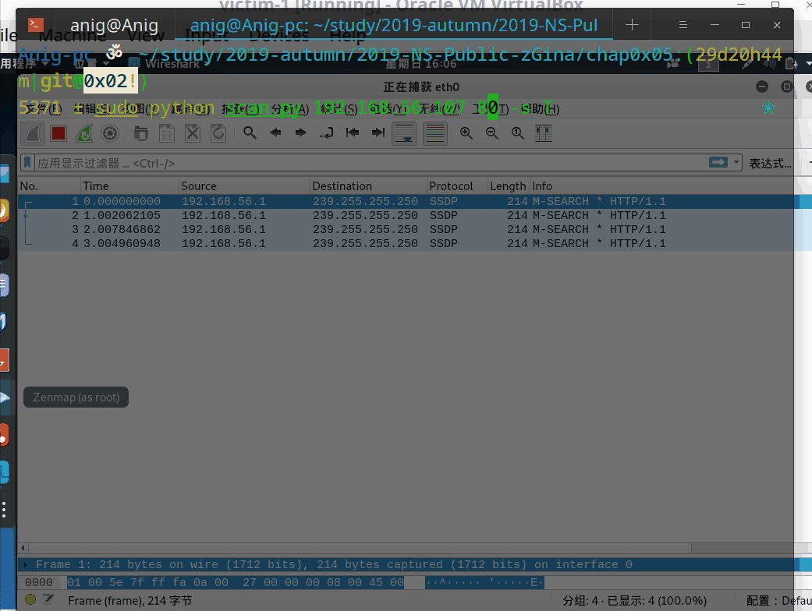
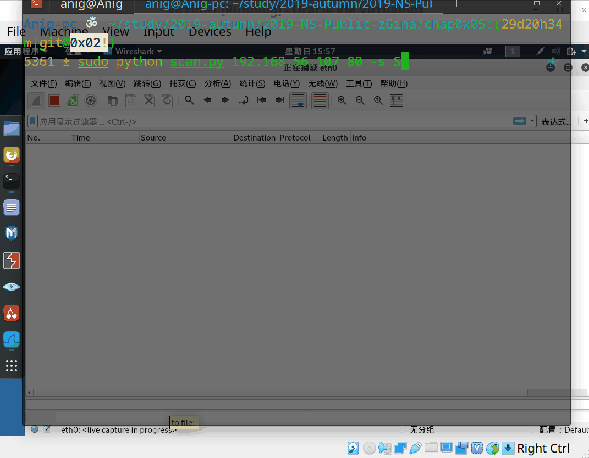
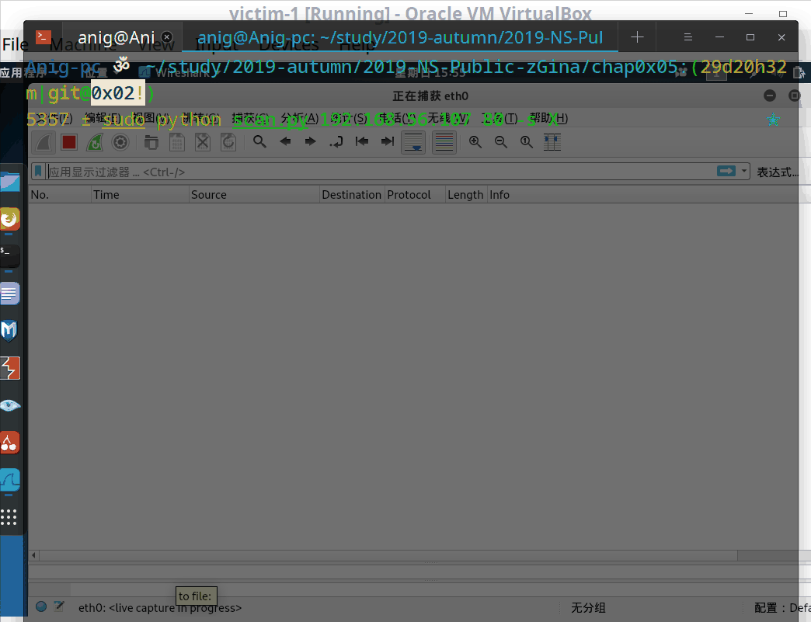
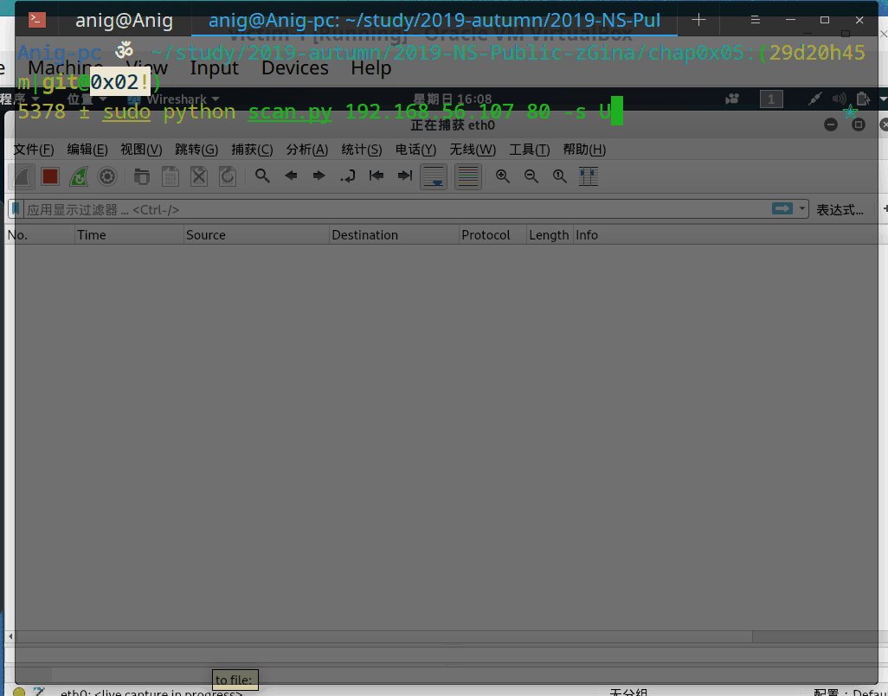

# 0x05 基于 Scapy 编写端口扫描器

## 实验目的

* 掌握网络扫描之端口状态探测的基本原理
## 实验环境
* Python + Scapy 
## 实验要求
* [x] 禁止探测互联网上的 IP ，严格遵守网络安全相关法律法规；
* [x] 完成以下扫描技术的编程实现：
  * ```TCP connect scan / TCP stealth scan```
    * 两种 TCP 扫描十分相似，同样是客户端向服务器发送一个 SYN 包，若目标端口 open ，则服务器端返回 SYN+ACK ，但相比于 ```connect scan```，```stealth scan（syn scan）```客户端不会返回 RST+ACK 而是只返回 RST 数据包，不建立完整的 TCP 连接。后者是 nmap 具有 root 权限下的默认扫描方式，好处 : 快速、不易被防火墙记录进日志
    * ```SYN 泛洪攻击与监测```
  * ```TCP Xmas scan / TCP fin scan / TCP null scan```
    * 这三种扫描类似，若无回复，则目标端口 open，若返回一个 RST 包，则说明端口 closed。较 ``` SYN scan ```隐蔽性更高
  * ```UDP scan```
    * 若服务器返回 UDP 包，目标端口开放；若返回 ICMP Error（Type 3，Code 3），则端口关闭；若返回 ICMP Error（Type 3，Code 1,2,9,10 or 13），说明端口被过滤；若无任何响应，可能开放或被过滤，无法判断端口状态。
* [x] 上述每种扫描技术的实现测试均需要测试端口状态为：开放、关闭 和 过滤 状态时的程序执行结果；
* [x] 提供每一次扫描测试的抓包结果并分析与课本中的扫描方法原理是否相符？如果不同，试分析原因；
* [x] 在实验报告中详细说明实验网络环境拓扑、被测试 IP 的端口状态是如何模拟的；
* （可选）复刻 nmap 的上述扫描技术实现的命令行参数开关。

## 实验过程

#### 网络拓扑
采用 virtualbox Host-Only 网络
* ```Attacker 192.168.56.1```
* ```Victim 192.168.56.107```
#### 端口状态模拟
* open TCP port  
  * ```nc -l -p 80``` 或 ```socat tcp-listen:80 -```
  * ```iptables -I INPUT -p tdp --dport 80 -j ACCEPT```
* open UDP port
  * ```echo "request" | nc -luk -p 1080 -vv``` 或 ```echo "request" | socat udp-listen:1080 -``` 
    * 这里要注意的是 ```ctrl+z``` 退出，端口open，``` ctrl+c``` 则结束监听，使用 ```lsof -i```查看各个端口状态 。
    * 我和 netcat 还不太熟，不清楚如何才能创建一个后台运行对任意 udp 探测包都 echo request 的 udp 端口监听，以上命令行只能保持第一次 echo request，于是 Attacker 判定 port Open，Victim 就自动关闭了 udp 监听，之后再试图 connect 不会收到 response
  * 实现一个 echo server
    * Victim：```nc -e /bin/cat -ukl -p 1080``` 或 ```socat -v PIPE udp-recvfrom:1080```
    * Attacker: ```socat - udp-connect:192.168.56.107:1080```
  

* filtered port
  * ```service ssh start``` 开启 port 22
  * ```iptables -A INPUT -p tcp --dport 22 -j REJECT```
  * 
    >REJECT vs DROP when using iptables 
    DROP does nothing at all with the packet. REJECT differs to DROP that it does send a packet back, but the answer is as if a server is located on the IP, but does not have the port in a listening state.  iptables will sent a RST/ACK in case of TCP or with UDP an ICMP destination port unreachable 
    REJECT 默认返回 type 3,code 3 的 ICMP 包
    -A append 队尾 -I insert 默认队首 
    值得注意的是 REJECT udp 包只能是icmp ，而 tcp 两种方式都可
    几种配置方式 : 
    iptables -A INPUT -p udp --dport 22 -j REJECT --reject-with icmp-port-unreachable
    iptables -A INPUT -p tcp --dport 22 -j REJECT --reject-with [tcp-reset] | [icmp-port-unreachable]
    iptables -I INPUT -p tcp --tcp-flags ALL ACK --dport 80 -j DROP
    iptables -I INPUT -p udp --dport 1080 -j REJECT --reject-with 
    icmp-host-unreachable/icmp-net-unreachable/icmp-host-unreachable 等

    因此针对不同的 nmap 扫描方式 ：
    ```DROP```可能判定为 filtered 或 closed 或 open|filtered ```REJECT```可能被判定为 closed 或 filtered 
* closed port
  * 随便一个没监听、无服务的端口
  * ```443```

#### 端口扫描
* TCP connect scan / TCP stealth scan
  * shake one
    *  ```resp=sr1(IP()/TCP(flags="S"))```
  * shake two
    * if ```resp == "" and sT ``` : port Closed // resp 为空即是说 no response?
    * if ```resp == "" and sS``` 或 ```ICMP.type = 3  ICMP.code in [1,2,3,9,10,13] and sS``` 或 ```TCP.flags == 0x14 and sS``` : port Filtered
    * if ```TCP.flags == 0x14``` 或 ```ICMP and sT```: port Closed
    * if ```TCP.flags == 0x12``` : port Open 
  * shake three
    * if ```sT``` : ```send(IP()/TCP(flags="AR")```
    * if ```sS``` : ```send(IP()/TCP(flags="R")```
  * ```connect scan```扫描结果如下: 
  
  *  ```connect scan```扫描结果如下: 
  
* TCP Xmas scan / TCP fin scan / TCP null scan
  * shake one
    * if ```sX``` : ```Xmas_scan_resp = sr1(IP()/TCP(flags="FPU"))```
    * if ```sN``` : ```NULL_scan_resp = sr1(IP()/TCP(flags=""))```
    * if ```sF``` : ```ACK_scan_resp = sr1(IP()/TCP(flags="F"))```
  * shake two
    * if ```resp =="" ``` : port Open | Filtered (端口开放但服务无response 或者被 drop 了无response)
    * if ```TCP.flags == 0x14``` : port Closed (也可能是iptables reject TCP-RST！)
    * if ```ICMP.type = 3 and ICMP.code in [1,2,3,9,10,13]``` : port Filtered
  * no shake three  
  *  ```Xtree scan```扫描结果如下: 
  
  * ```fin scan``` 和 ```null scan``` 结果在imgs文件夹中，与 ```xtree scan``` 类似
* UDP scan
  * step 1 
    * ```udp_scan_resp = sr1(IP()/UDP())```
  * step 2
    * if ```resp ==""``` : port Open | Filtered
    * if ```resp.haslayer(UDP) ``` : port Open
    * if ```ICMP.type = 3 and ICMP.code = 3 ``` : port Closed
    * if ```ICMP.type = 3 and ICMP.code in [1,2,3,9,10,13] ``` : port Filtered
  *   ```UDP scan```扫描结果如下: 
  

#### 结果分析
* 由结果可以看出，基于 Scapy 编写的端口扫描器得到的结果与课本中的扫描方法返回基本相符
* 还没有研究 为何我的 connect scan 中，主机收到 ACK 包后，为什么会发出一个 RST 包再发 ACK+RST 
## 实验心得
* netcat 和 socat 用处很大 ,iptables 还有很多种配置方式
* UDP 是无状态协议，所以不会出现类似 TCP 某某端口[listen] 这样的情况
* 一定要有耐心、有耐心地看英文文档
* 以后做实验要注意随时记录，不然会像这次一样没有心得可写
## reference
* [how-to-get-a-udp-response-with-netcat?](https://serverfault.com/questions/128956/how-to-get-a-udp-response-with-netcat)
* [如何用Scapy写一个端口扫描器？](https://www.freebuf.com/sectool/94507.html)
* [Start Scapy](https://scapy.readthedocs.io/en/latest/usage.html)
* [2018-NS-Public-TheMasterOfMagic](https://github.com/CUCCS/2018-NS-Public-TheMasterOfMagic/tree/ns-chap0x05/ns/chap0x05)