# Web 应用漏洞攻防

后来，老黑想起来他年少时在黑暗中一次又一次的摸索，在夕阳下的奔跑，那个傻乎乎地拿着工具乱扫的 Script kiddie，

## 实验目的

- 了解常见 Web 漏洞训练平台；
- 了解 常见 Web 漏洞的基本原理；
- 掌握 OWASP Top 10 及常见 Web 高危漏洞的漏洞检测、漏洞利用和漏洞修复方法；

## 实验环境

- WebGoat

- Juice Shop

## 实验要求

- [ ] 每个实验环境完成不少于 **5** 种不同漏洞类型的漏洞利用练习；
- [ ] （可选）使用不同于官方教程中的漏洞利用方法完成目标漏洞利用练习；
- [ ] （可选）**最大化** 漏洞利用效果实验；
- [ ] （可选）编写 **自动化** 漏洞利用脚本完成指定的训练项目；
- [ ] （可选）定位缺陷代码；
- [ ] （可选）尝试从源代码层面修复漏洞；

## 实验过程

### 未验证的用户输入

### 缓冲区溢出

### 注入缺陷

- 确定目标数据库/操作系统类型版本
  - 数据库 cheatsheet
  - OS sensitive file cheatsheet
- 解决
  - 避免直接使用外部解释器，而是编程语言的 API
  - 编码后再将数据发给后台

#### juice shop

小黑先来到橘子商店的世界，差点被`score-board`就劝退了。参考书说`href="#/score-board` 就隐藏在 HTML 的注释里，很容易被发现。然而，为此：

- first simple goal?

  - 油猴或者 chrome Dev->Sources->Snippets 中添加如下[脚本](https://stackoverflow.com/questions/13363946/how-do-i-get-an-html-comment-with-javascript)可在页面加载时在控制台列出 HTML 中所有被注释的内容
    
    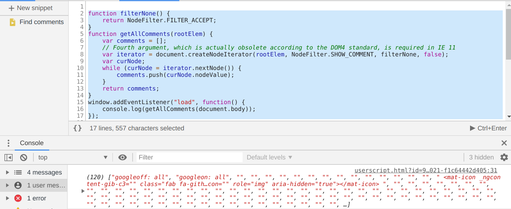

    没有丝毫 score-board 的踪迹
  - 当然不能就这样结束。分析页面资产其中 js 又是重中之重。小黑一眼看出 main.js 很重要，同时该 js 又未经过混淆。可以用一些常用的例如`register`来顺藤摸瓜出别的 API 接口，score-board 也在这
  
    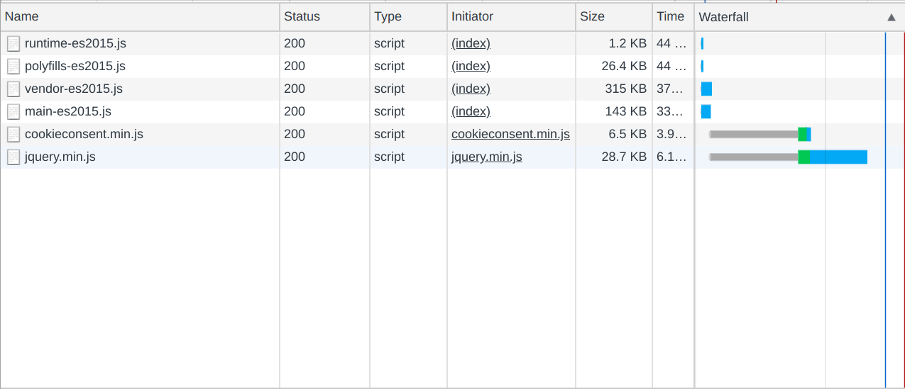

- 乱输入一个引号，发现报错，得到以下信息：

  - 数据库类型：SQLite
  - 直接拼接 SQL 语句
  - 表：Users 字段：email，password，deletedAt
    
    

- 小黑手持[SQLite Injection](https://github.com/swisskyrepo/PayloadsAllTheThings/blob/master/SQL%20Injection/SQLite%20Injection.md)，邮箱字段输入`'or TRUE--`即可登录 admin(谁叫 admin 恰好是 user 表 no.1 呢
  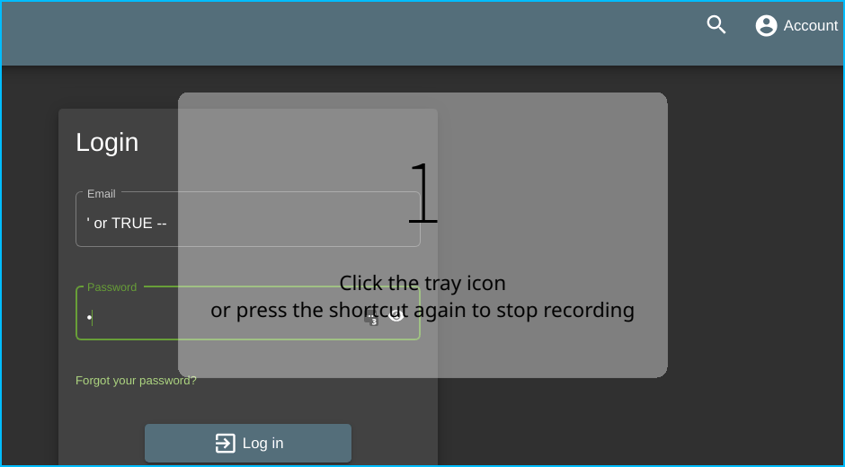

- ”我这么容易就是 admin 了？“小黑没高兴几秒，急匆匆想利用 API`search?q=` union select 来进行`回显注入`提取所有表的内容，却落得一场空。
  - 小黑还是太年轻，很想知道怎么没有动用数据库。先记下搜索框 id，到资源栏里搜搜它是怎么被使用的，定位到`main-es2015.js`(Firefox 直接有 EventListener 很方便(看到好多提示 233
    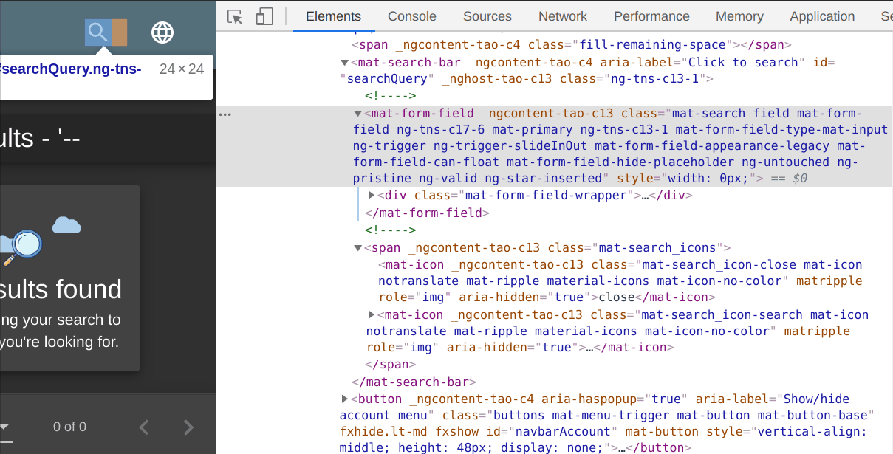
  - 再综合 XHR，判断页面是单次 get 请求查询，后根据 js 来过滤的
    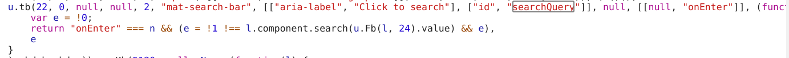
- 显然，小黑 web 框架(flask)没学好，导航栏 url 和 request url 才不是一回事啊摔！
  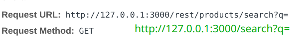

  - 接下来揣测一下 query 的 sql 语句机制(也许可以省略？)
    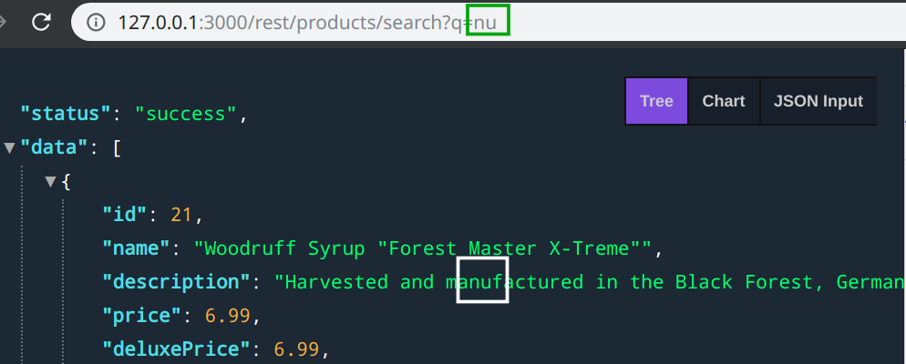
    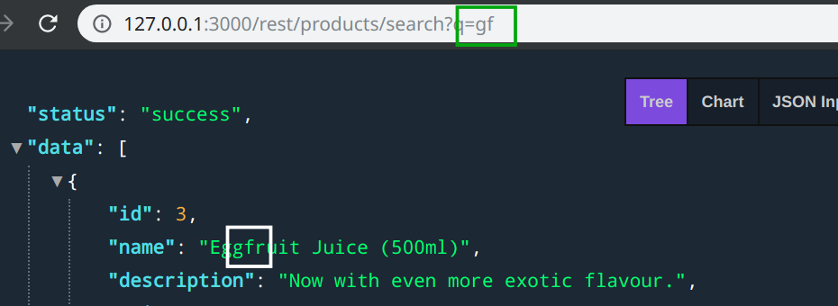
    小黑猜测是在 description 和 name 两个字段中模糊查询
  - 然后就是一通乱试加分析，当 q="'时结果如下
    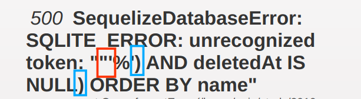
    可以简略地下个结论：闭合 q 查询需要两个右括号。
  - 接下来 union select 就可以出来大展拳脚了`')) UNION SELECT * FROM USERS--`
    显然，Users 表和 Products 表(姑且先这么称呼着)返回的列数不同，那么将 Users 已知字段和几个虚拟列拼接起来等于 Pro 列数目即可
    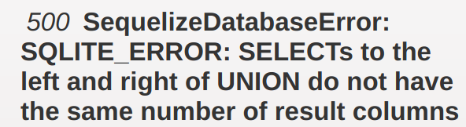
    `helloSQL')) UNION SELECT email,password,deletedAt,1,2,3,4,5 FROM USERS--`
    但这样因为某些`deleteAt`字段会返回 NULL 值，在网站后续一些处理中会报错(具体先不研究了)，于是去掉该字段，小黑得到 Users 表的 email 和 password
    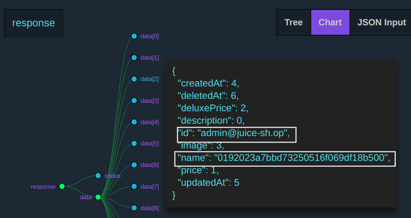

- 查看源码发现：① 未对用户输入做任何验证或转义或编码处理 ② 直接拼接 SQL 语句 ③ 密码 md5 存储 ≈ 明文存储

  ```sql
  models.sequelize.query(`SELECT * FROM Users WHERE email = '${req.body.email || ''}' AND
  password = '${insecurity.hash(req.body.password || '')}' AND deletedAt IS NULL`,
  { model: models.User, plain: true })

  ```

  ```js
  exports.hash = data =>
    crypto
      .createHash("md5")
      .update(data)
      .digest("hex");
  ```

- 解决
  - 小黑本来的的天真想法
    - 不拼接，改用`SELECT psd FROM Users WHERE email=’balabala‘` 查询得到的结果
      来与用户输入的 hash(psd)比对，若相等则允许登录。但根本问题未解决：数据库字段以及错误信息完全暴露，黑客可导出各表信息根据彩虹表得到密码并登录
  - 纵深防御
    - 更换口令 hash 方式为 PBKDF2
    - 数据库处理要求权限
    - 操作失败时，不要将原始错误日志返回，而是统一报错
    - **参数化 SQL 查询**
      详情见 [为什么参数化 SQL 查询可以防止 SQL 注入?](https://www.zhihu.com/question/52869762)
    - 本来可以写好多点的但是有了上面的「参数化，预编译」 **好像**其他的都不需要了

### 跨站点脚本 XSS

#### juice shop

现在，小黑假装不知道 email 以及对应口令，他设法从 XSS 钓鱼的角度得到账户密码

- ① 数据收集
  收集大量 juice shop 用户的信息以提高钓鱼成功率
  - ~~爬取商品的 review 区用户的账号及评论~~ 根据 API `/rest/products/$id$/reviews`得到用户 email 及其喜好 (社会工程学 233
    发送免费果汁链接的邮件到用户 email
  - 评论区内容内联了，下面两种方式意义不大
    - 在评论区少量留言 `free juice` 链接，定向至劫持用户 cookie 或钓鱼界面
    - 在自己的 profile 注入 xss，留下吸睛的评论使人点进小黑 profile
- ② 对网站各页面进行 xss 测试

  - `DOM xss`

    - 过程
      首先搜索框输入`<script>alert(1)</script>`试图 reflected xss。这里`插入为DOM文本的JavaScript将不会执行`，输入的任何内容都会被`<span>`标签内联，就像前面的 SQL 注入被参数化一样(?)动态生成，输入`</span>`也无法绕过

    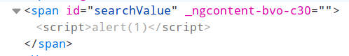

    - 解决
      可以注入数据或能执行 script 的内联元素如：``，`<select onfocus=javascript:alert(1) autofocus>`，`video,math`等等等等 或 `` <iframe src="javascript:alert(`xss`)"> ``最终实现的是较特殊的 DOM-xss

    - reference：

      [Under which conditions wouldn't a script tag run](https://security.stackexchange.com/questions/127711/under-which-conditions-wouldnt-a-script-tag-run)

      [那些年我們沒能 bypass 的 xss filter](https://www.itread01.com/content/1510406597.html)

  - 答案又骗小黑之 `reflected XSS`
    - 在`track-order`页面参考答案说输入`` <iframe src="javascript:alert(`xss`)"> ``就能回显，实现反射型 xss，但很显然这里几乎所有特殊字符都被过滤了
      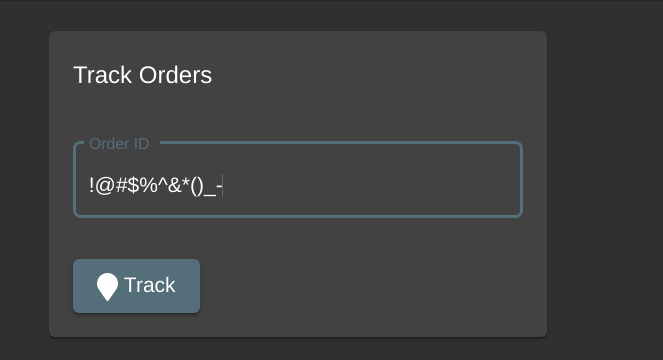
    - 机缘巧合之下，小黑一直在`由源码 npm start`，`docker拉取`和[线上平台](https://juice-shop.herokuapp.com/) 三个 juice shop 玩耍。发现，通过`npm start`启动时确实能实现 reflected xss 并显示以下友好提示 : `unavailable on Docker` 具体原因未知。(两个本地运行的 score-board 实现数据居然是同步的，即使端口相同(其实是改端口改失败了，怎么着都是 3000)也不冲突，但是会按启动顺序决定，只能进入先运行的那个)
      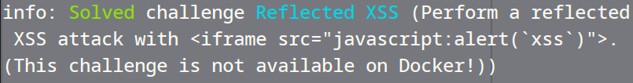
  - 以上，小黑通过 `search?q=` 和`track-order?id=`两种不同的 query 逻辑而得到的不同类型 XSS：
    - DOM XSS : 数据已经通过一次查询到达前端，此类注入语句只是由 js 处理，永远不会到达后端。相比之下，DOM XSS 存在更广泛；不会经过后端严格的过滤，更易 passby
    - reflected XSS：多了个到达后端的行为
  - `persisted XSS`
    - 首先想到的是在/profile 页面(这个页面反应真的是太太太太太慢了)通过修改 username 为``，发现``标签，且被加了转义斜线
      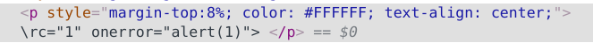
    - 改用 HTML 编码同时闭合`<p>`试图绕过：`</p>&#x3C;img src=&#x22;1&#x22; onerror=&#x22;alert(1)&#x22;&#x3E;`
      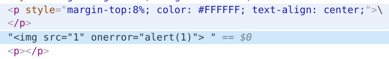
      发现被加了双引号，这里无法绕过了，因为注入的内容处于`<text>`字段。应该是采用了 jQuery.text()进行转义。该方法是完全 XSS 安全的
    - 接下来试图上传用户头像文件注入
      1. 检测文件允许类型，过滤得很稳当。严格要求图像格式，svg 也不行。
      2. 尝试文件名改为`svg onload=alert(1).jpg`，但被后台重命名了。弱点是命名非常有规律，随便就能无聊地试出前面用户的头像以及猜测 images 路径的同级文件夹
         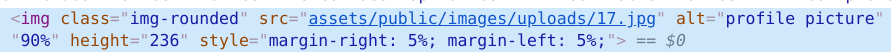
         此路暂卒
    - reference
      [is-jquery-text-method-xss-safe](https://stackoverflow.com/questions/9735045/is-jquery-text-method-xss-safe)
      [深入理解浏览器解析机制和 XSS 向量编码](http://bobao.360.cn/learning/detail/292.html)

- ③ 构造 XSS 漏洞链接伪装并群发之
  - beEF 框架的使用

### 脆弱的访问控制

- 脆弱
  - 内容或程序功能未能有效地保护以限制只允许合法用户的访问
    - 只对 URL 鉴权 而不是内容
    - 认证只发生在用户登录时
    - 分散授权管理
- 解决方案
  - 对每个需要保护的请求进行检查
  - 不要自己动手造轮子，而是使用 CMS，Acegi 等框架
    - 采用声明式而非硬编码的访问控制
    - 集中化访问控制
  - 主体&客体 平行/提升权限访问
    - 属主权限检查
    - 使用 ACL

### 脆弱认证和会话管理

现在假设小黑经上一步已经拿到了一部分用户 email 信息：
jim@juice-sh.op，admin@juice-sh.op，morty@juice-sh.op，mc.safesearch@juice-sh.op，bender@juice-sh.op

bjoern 很高冷，不评论，不通过 sql 注入要拿到 bjoern@juice-sh.op 账户还挺麻烦的

- 脆弱的`忘记密码`功能：① 直接显示密保问题 ② 问题太脆弱易爆破：
  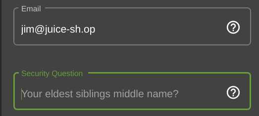

  直接扔进 burpsuite intruder 进行爆破，注意事项：

  - 此处爆破人名，payload type 可选择 case modification
  - 对 payload 进行合理的处理、猜想
    一个 Top 1000 English NameList 在第 120 条爆破得出密保为 Samuel
    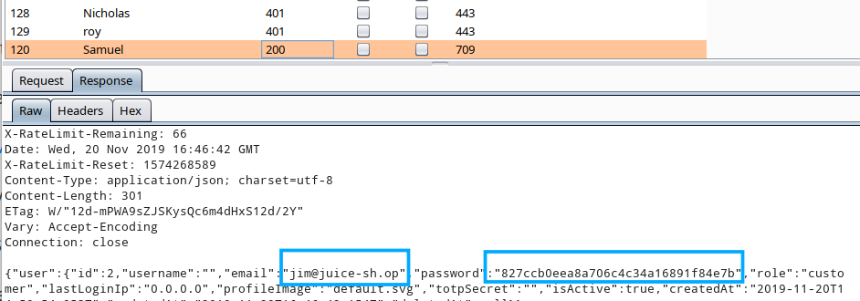

- 脆弱的`CAPTCHA`：① 没有有效期，通过一次可多次重放 ② 问题过于简单，可枚举 ③ 甚至访问页面时请求 captcha 直接返回了所有数据
  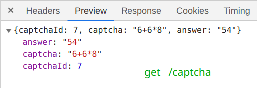
  - 解决：re-CAPTCHA 
---
- 典例
  - 未采用 session cookie，而在 url 中编码已通过认证的用户名和密码
  - 脆弱用户名及其口令
  - 有缺陷的忘记密码机制
  - 假冒已通过身份认证的合法用户
- 解决
  - 强认证
    - 密码策略
    - 安全传输 SSL
    - 安全的找回密码功能
    - 移除默认用户
  - session 机制
    - cookie 必须是安全的 (readonly)
    - session id 不可预测

### 不安全的存储

- 典例
  - bak 文件的存储
  - 数据未加密存储
  - 密钥、证书等采用了不安全的存储介质
  - 弱随机序列生成器
  - 弱加密
  - 未采用安全的密钥交换机制
- 解决
  - 仅存储必须存储的数据
    - hash 值
    - 要求用户每次重新输入
  - 不允许对后台应用程序的直接访问
    - 数据库
    - 文件系统
  - 不在 web 应用服务器的根目录存储重要文件
  - 使用原生库加密算法

### 不安全的配置管理

- web 应用程序的运行环境
  - 应用程序服务器(Tomcat)、Web 服务器(IIS 等)
  - 后台系统
  - 操作系统和基础网络架构
- 常见漏洞
  - 未及时更新安全补丁
  - 不必要的默认、备份文件
  - 开放具有管理权限的服务
  - 默认账户口令
  - 配置不当的 SSL 证书
- 解决
  - 每个服务器创建安全基准
  - （半）自动化配置
  - 保持更新

### 拒绝服务攻击

- 实例
  - 有限的资源容易成为 DoS 攻击的目标
    - 带宽
    - 数据库连接
    - 磁盘容量
    - CPU 资源
    - 内存
    - 最大并发线程数/可用文件句柄
  - 特定于用户的 DoS
    - 用户并发访问控制锁
    - 用户密码更改
  - 未处理的程序异常
- 解决
  - 避免可能会导致资源密集型消耗的请求
    - CPU 频繁的请求
    - 内存或磁盘容量 大数据量的 POST
    - 匿名用户访问的限制
  - 测试大负载情况性能
  - 利用缓存服务器或限制数据库连接
  - 谨慎使用“锁”机制

### 跨站点请求伪造 CSRF

### PHP 的文件包含漏洞

### 文件上传漏洞

大概浏览一下，网站一个有三个地方可供上传文件：

- /profile
  - xss 中已经尝试过
- /complain
- /photo-wall
  - 以上两个较为相似，一个是绕过文件小于 100kb，一个是绕过文件限制 zip，pdf 格式。原因都是前端限制有漏洞。在 postman 中修改包数据发送即可
  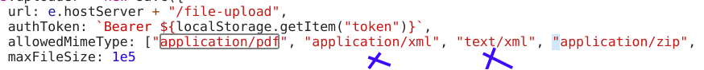
### 字符编码漏洞

### 第三方程序漏洞

## 心得

- 要清楚每个 API 接口返回的数据类型，猜测&验证在后台&前端做了哪些处理
