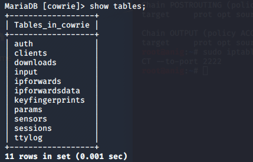
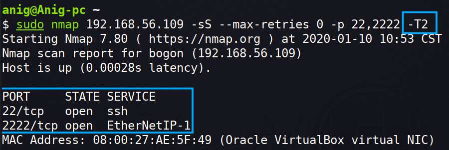
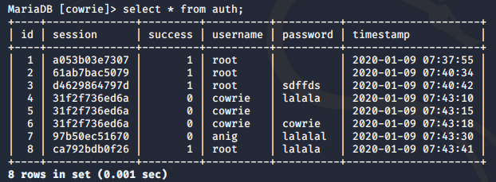
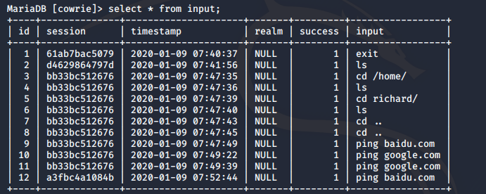
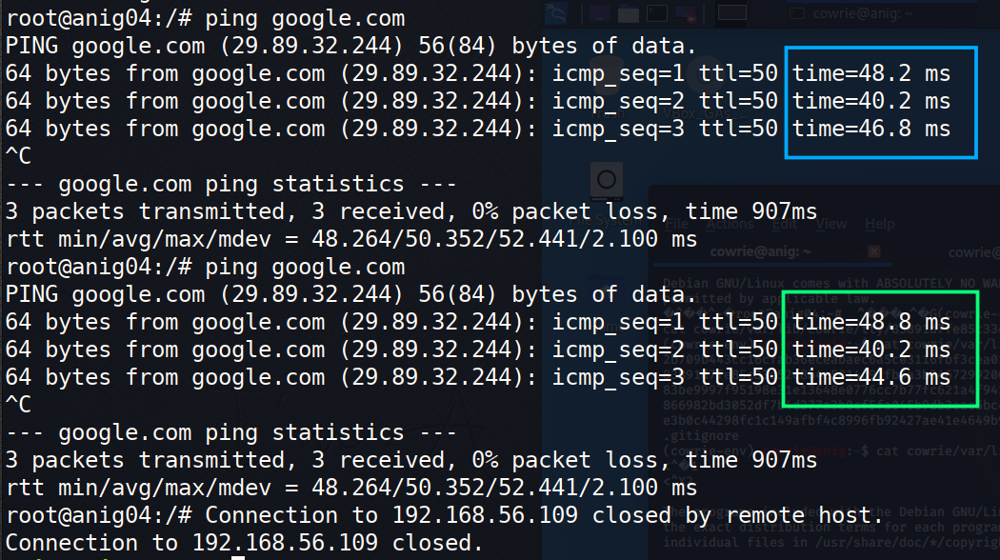
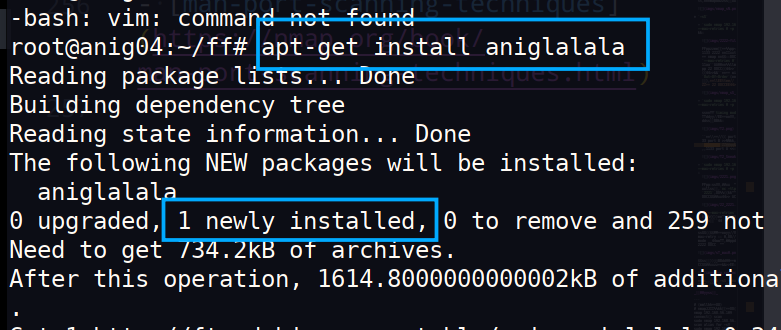

# 常见蜜罐体验和探索

## 实验目的

- 了解蜜罐的分类和基本原理
- 了解不同类型蜜罐的适用场合
- 掌握常见蜜罐的搭建和使用

## 实验环境

- 低交互蜜罐 `glastopf`

- 中等交互蜜罐 `Cowrie`

## 实验要求

- 记录蜜罐的详细搭建过程；
- 使用 `nmap` 扫描搭建好的蜜罐并分析扫描结果，同时分析「 `nmap` 扫描期间」蜜罐上记录得到的信息；
- 如何辨别当前目标是一个「蜜罐」？以自己搭建的蜜罐为例进行说明；
- （可选）总结常见的蜜罐识别和检测方法；
- （可选）基于 [canarytokens](https://github.com/thinkst/canarytokens) 搭建蜜信实验环境进行自由探索型实验；

## 实验过程

### 低交互蜜罐 `glastopf`

#### 环境搭建

### 中等交互蜜罐 `Cowrie`

虚拟机信息


#### 环境搭建 (虚拟机网络为 bridge)

照[官方步骤](https://cowrie.readthedocs.io/en/latest/INSTALL.html)搭建

```
step 1: On debian based systems,For a Python3 based environment:

sudo apt-get install git python-virtualenv libssl-dev libffi-dev build-essential libpython3-dev python3-minimal authbind virtualenv

Step 2: Create a user account

sudo adduser --disabled-password cowrie
sudo su - cowrie

Step 3: Clone cowrie

git clone http://github.com/cowrie/cowrie
cd cowrie

Step 4: Setup Virtual Environment and active it

virtualenv --python=python3 cowrie-env
source cowrie-env/bin/activate
pip install --upgrade pip
pip install --upgrade -r requirements.txt

Step 5: Configure cowrie.cfg

cd etc/
cp cowrie.cfg.dist cowrie.cfg
vim ./cowrie.cfg #配置蜜罐主机信息

# (default: svr04)
hostname = anig04

#　方便观察log 这里配置下sql
[output_mysql] #前面默认的注释符要去掉不然 twisted 不会parse了
enabled = true
host = localhost
database = cowrie
username = cowrie
password = aniglalala
port = 3306
debug = false

Step 6: Starting Cowrie

cd ..
bin/cowrie start
```


**端口重定向**

Make Cowrie accessible on the default SSH port (22)

```
1.iptables

#iptables端口转发属于系统范围，需要作为root身份执行
exit
sudo iptables -t nat -A PREROUTING -p tcp --dport 22 -j REDIRECT --to-port 2222

```


**安装 第三方可视化 mysql**

```
＃root 用户下
＃官方建议的 mysql-server 被遗弃了这里改成mariadb

sudo apt-get install libmariadb-dev
su - cowrie
source cowrie/cowrie-env/bin/activate
pip install mysqlclient

#开启服务，会被要求输入root用户的密码
systemctl start mariadb

# 默认无密码 直接回车
# 创建用户 cowrie
mysql -u root -p
GRANT ALL ON cowrie.* TO cowrie@localhost IDENTIFIED BY 'aniglalala';
flush privileges;
exit
# 进入存放sql文件的目录下
cd docs/sql/
mysql -u cowrie -p
# 输入自己的密码`aniglalala`
# 建表
use cowrie;
source ./mysql.sql;
exit
```
结果如下,它们初始均为空


```
# 重启服务
cd
./cowrie/bin/cowrie restart
```

这里出了点小插曲就是 `#[output_mysql]` 前面的`#`没有去掉，发现重启失败

报错信息为


也就是 `[output_jsonlog]` 字段`enabled`重复

```
#验证mysql服务开启
cat ./cowrie/var/log/cowrie/cowrie.log
```

可以看到 cowrie 加载到 mysql 服务已经启动


#### 模拟攻击&观察

- 网络拓扑 host only(1.测试安全 2.减少包流量方便观察)
  - Attacker `192.168.56.1`
  - HoneyPot `192.168.56.109`

**nmap**

_攻击者方结果_

- `-sN; -sF; -sX`结果一致
  
  分析：根据 nmap 判定端口状态的规则:根据 RFC 中对端口判定的漏洞，当发送不含 SYN, RST, or ACK 标志的包时，如果目标端口关闭，将返回 RST，如果端口打开则无响应。若目标系统存在该漏洞则会暴露端口状态。iptables 设置端口 22 重定向至 2222 之后,由于

  > The key advantage to these scan types is that they can sneak through certain non-stateful firewalls and packet filtering routers. Such firewalls try to prevent incoming TCP connections (while allowing outbound ones) by blocking any TCP packets with the SYN bit set and ACK cleared.

  `sN,sF,sX`扫描类型的包穿透了防火墙的过滤,因此关闭的 22 端口会直接返回 RST 包,而正常开放的 2222 端口不会有任何响应,与nmap判定结果相符

  

* `-sS`

  - `sudo nmap 192.168.56.109 -sS --max-retries 0 -p 22,2222` 结果如下:

    

    分析：该类型包到达端口 22 被防火墙转发至 2222 后有相应返回的 ACK 包,会被 nmap 确认为端口开放,由于`--max-retries 0`如果则在端口上只发送一次数据包，不会进行重试。可以看到 22 端口在返回一个正确 ACK 包之后又返回了一个被 wireshark 认为是`Out-Of-Order`(经多次测试均是此结果),**本来应该是 2222 返回的包为什么会被 22 端口来返回呢？**

    

  - `sudo nmap 192.168.56.109 -sS --max-retries 0 -p 22,2222 -T2`

    当修改`timing mode`为 T2 以较为轻柔的方式来扫描时,可以得到两端口均开放的结果如下:

    

    一个猜测是在 port A 被`redirect`至 port B 设置下,*一定时间*内`iptables`会无脑将 port B 返回的包转发至 port A 作为出口,待查证

    

  - `sudo nmap 192.168.56.109 -sS --max-retries 0 -p 22,2221`结果如下:
    

    分析:当然,正常开放另一个端口可以得到相同结果,`nc -tlp 2221`开启一个端口`2221`,可以在下图看到 22 和 2221 端口均正常返回 ACK

    

    将`--max-retries`改为大于 0 的数值或者去掉该参数(默认>0)之后与`-sT`扫描结果一致

- `-sT`  
  当采用此种扫描方式时,不管是设置 max-retry 为 0,还是修改 timing mode 使更粗暴,得到的结果均一致:22 和 2222 端口开放

  

  此结果让上面的推测不太站得住脚,因为两端口均正常建立了连接:

  

  **它和上面 -sS --max-retries 0 扫描产生差异结果原因？**

_蜜罐方结果_

```
# (不完全测试)
# nmap只有以下类型可在cowrie查看到记录
nmap 192.168.56.109  # 默认 TCP connect() scan
sudo nmap 192.168.56.109 -sR #RPC scan alias for -sV
sudo nmap 192.168.56.109 -sT #与上面的(non sudo)nmap一致
sudo nmap 192.168.56.109 -sV #version detect
```

记录如下：


只有完成三次握手类型得到了记录,与 session 一词隐含的“连接”意义相符。猜想`cowrie`使用的库判断一次 session 较为严格:调用了系统调用 `connect` 才会被记录(需要操作系统底层的知识还没来得及学)

这个追根溯源得`twisted.python.syslog`再更底层去,暂停先 //todo

**ssh**

```
#因为没有配置userdb所以这里输入任何密码都能直接登录
ssh root@192.168.56.109
$anything you like
```

ssh 时测试的记录可在`auth`表中查看：



tty 输入的记录可在`input`表查看：



#### 辨别蜜罐
**易突破**

如上面未配置用户密码的情况下,过于容易就成功ssh,采用一些低安全性密码即可怀疑是否进入了蜜罐

**信息失真**
- ping
  
  如图,两次ping的结果时间差一致

    
- apt-get  
  一个显然不存在的包成功install

  

  
### reference

- [man-port-scanning-techniques](https://nmap.org/book/man-port-scanning-techniques.html)
